# README

## 自带存档

项目目录下，loadfile1.txt

## 使用方式

### Server

运行代码后，出现主界面

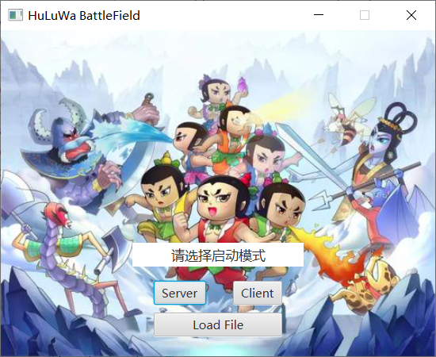

点击Server会启动server端，server端会等待两方接入连接后开始游戏。显示IP以供client端连接

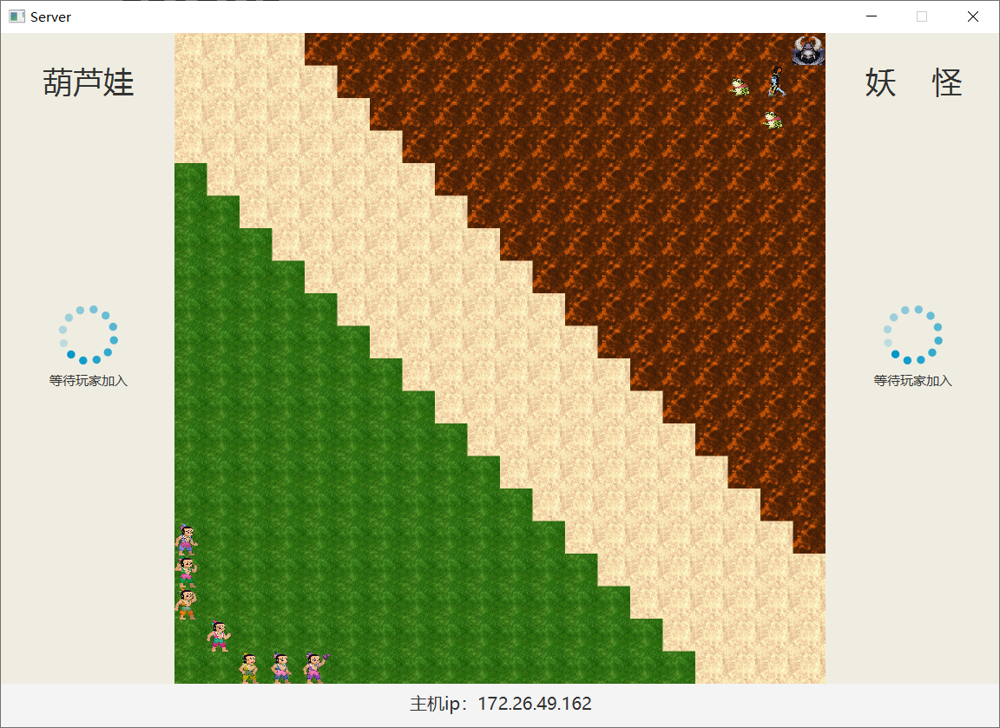

### Client

如果点击client端，会提供连接界面，输入Server的IP进行连接

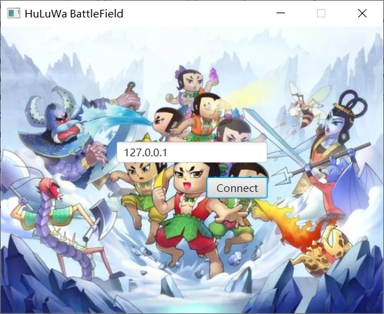

这里默认是连接本机，如果连接其他主机则需要修改ip

连接后，第一个玩家会进入等待界面，直到第二个玩家进行连接。

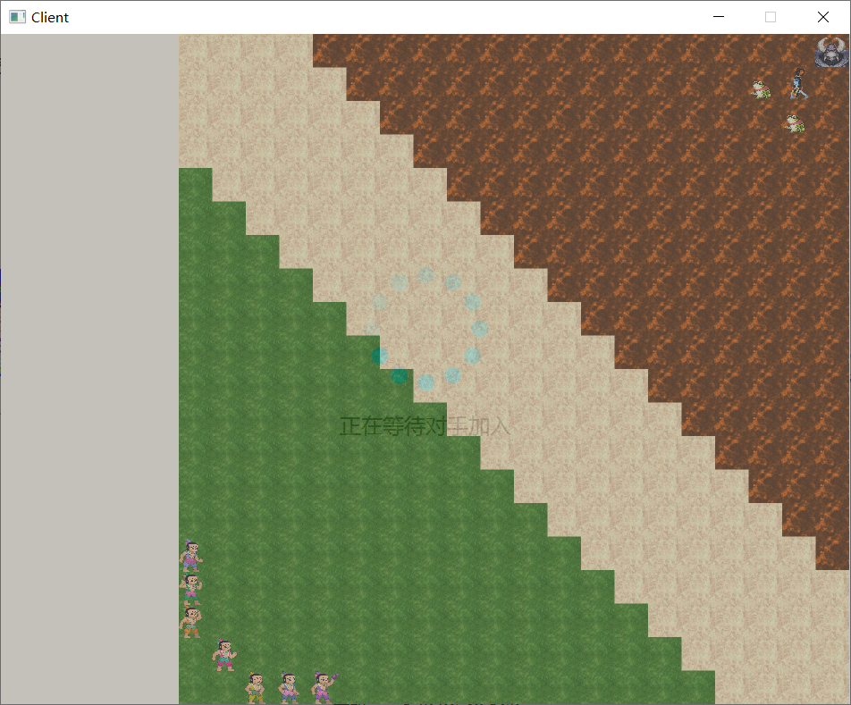

当两个玩家都连入后，游戏开始，初始化时会随机分配阵营和先后手。进入游戏，轮到自己操控时可以选择场上己方阵营的角色，选中时默认显示可移动位置，点击左侧攻击按钮时显示攻击范围，点击右侧技能按钮时释放技能，技能分为瞬发技能和指向性技能，指向性技能同样会显示攻击范围，然后选择敌人进行攻击。

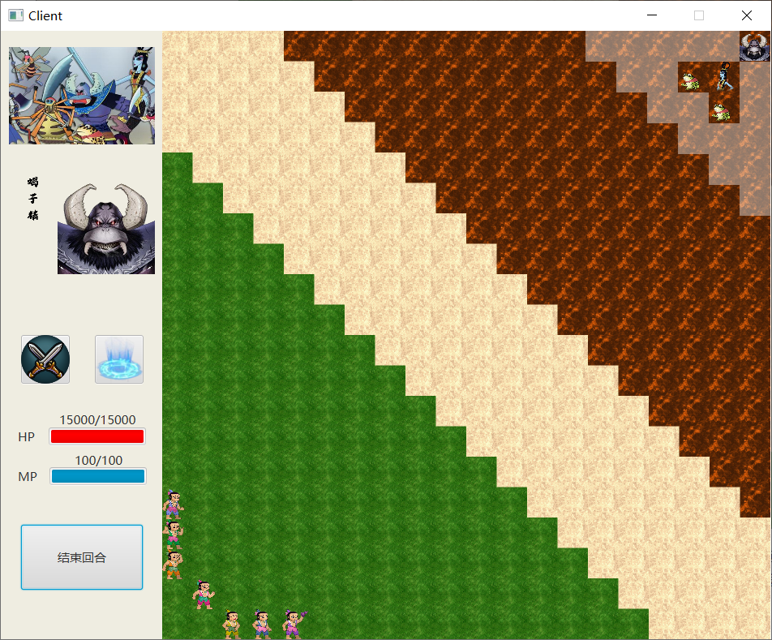

每个角色每回合只能移动一次，攻击一次，释放技能一次。同时，技能的释放受限于MP，对于技能描述和攻击描述可以将鼠标移到对应按钮进行查看

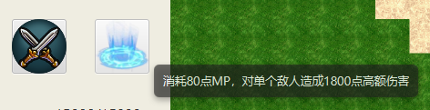

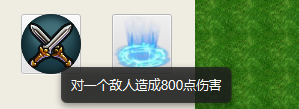

当点击结束回合是，左侧信息消失，等待对手结束对方回合之后才能够再次操作

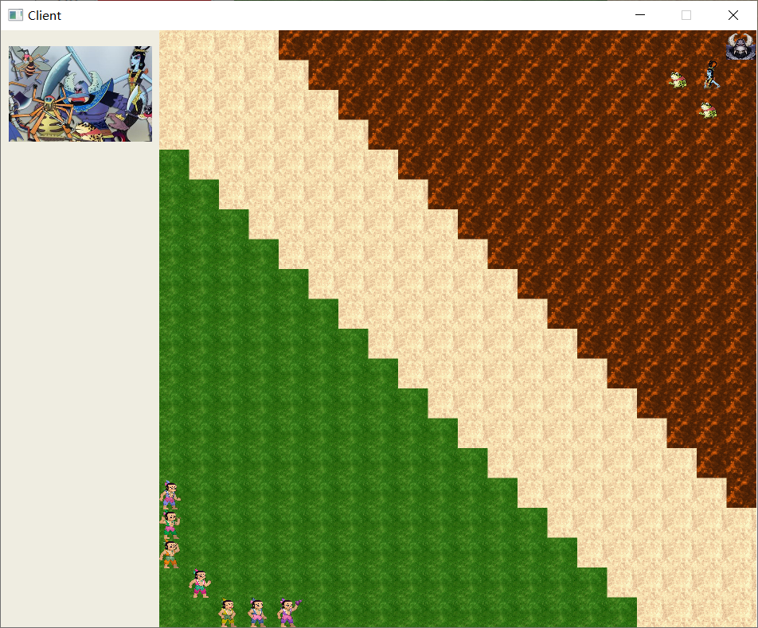

双方进行对战，当一方角色全部死亡时，游戏结束

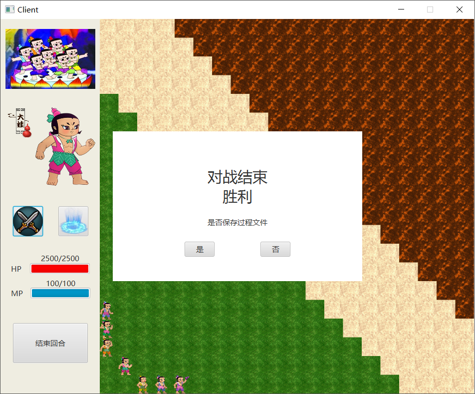

根据对局情况会显示胜利/失败

同时提示是否保存过程文件，点击“否”会退出程序，点击“是”会提供文件选择框，创建文件进行保存

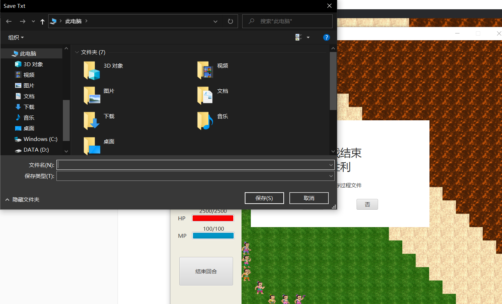

保存结束后，退出程序

Server端将在两个Client均推出后结束运行

### LoadFile

点击Load File，会启动回放界面

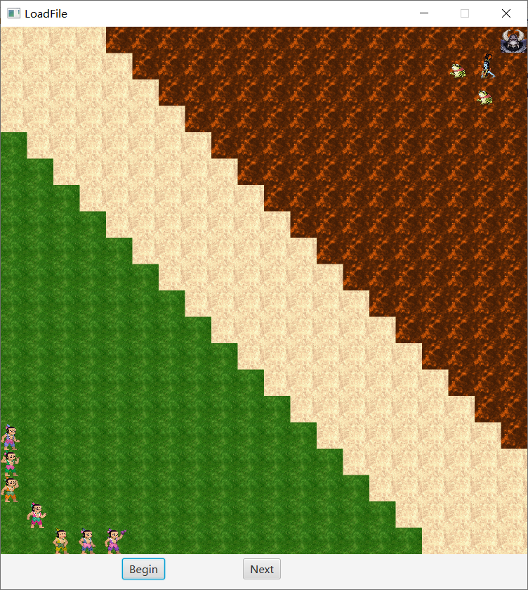

点击begin会弹出文件选择器，选择对应的文件进行回放

选择之后，点击Next按钮进行单步回放，方便了解每一步的操作

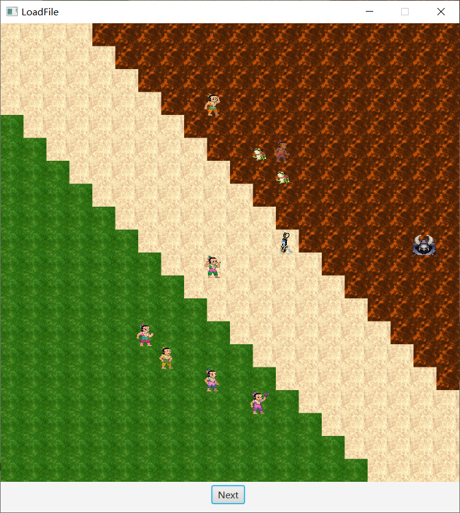

回放结束后需要手动关闭程序

## 设计思路

### 流程设计

本次实验的运行流程设置为：

- 由一台主机首先运行程序，运行Server端提供游戏主机。这一点借鉴于目前的部分网游，游戏公司提供主机，玩家进行连接
- 玩家运行Client端，通过连接Server端IP进行连接，当两名玩家均连入后游戏开始
- 游戏属于回合制游戏，关于角色即技能介绍将在下面的模块
- 游戏结束保存过程文件
- 开始界面除了Server和Client之外可以选择加载过程文件

### 角色及技能设计

角色类：

- creature 生物类
  - ControllableCreature 可操控的生物
    - HuLuWa 葫芦娃
      - One 大娃
      - Two 二娃
      - Three 三娃
      - Four 四娃
      - Five 五娃
      - Six 六娃
      - Seven 七娃
    - Monster 妖怪
      - SheJing 蛇精
      - XieZiJing 蝎子精
      - XiaoYao 小妖
  - UnControllableCreature 不可操控生物

#### 葫芦娃

**大娃**

普通攻击：对一个敌人造成500点伤害

特殊技能：消耗75点MP，2回合内（包括本回合），使普通攻击增加500点伤害

**二娃**

普通攻击：对一个敌人造成300点伤害

特殊技能：消耗75点MP，2回合内（包括本回合），使移动距离和攻击距离增加4格

**三娃**

普通攻击：对一个敌人造成400点伤害

特殊技能：消耗80点MP，2回合内（包括本回合），使普通攻击增加300点伤害，并免疫敌人的普通攻击

**四娃：**

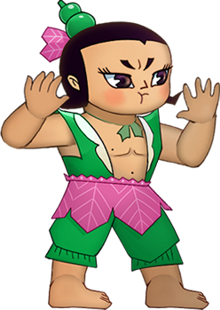

对一个敌人造成600点伤害

消耗90点MP，对一个敌人造成1500点高额伤害

**五娃：**

对一个敌人造成200点伤害

消耗100点MP，使场上存活的友方队友恢复20.0%的血量

**六娃**

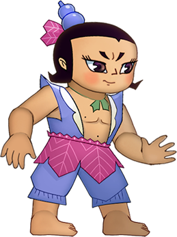

对一个敌人造成1000点伤害

消耗80点MP，2回合内（包括本回合），发动隐身

**七娃：**

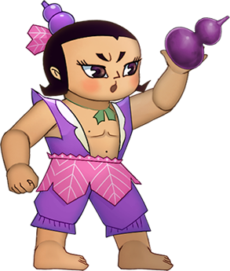

对一个敌人造成450点伤害

消耗100点MP，使一个敌人下回合无法移动，无法攻击，无法发动主动技能

#### 妖精

**蛇精：**

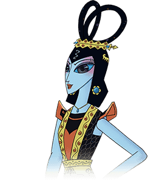

对一个敌人造成700点伤害

消耗100点MP，将一个敌人转变为可操控己方，回合结束后敌人恢复

**蝎子精**

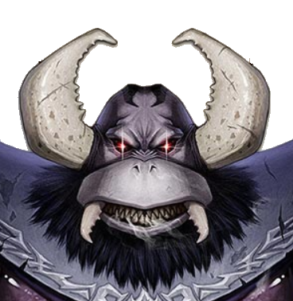

对一个敌人造成800点伤害

消耗80点MP，对单个敌人造成1800点高额伤害

**小妖**

对一个敌人造成300点伤害
消耗50点MP，对单个敌人造成600点伤害

### 项目结构

> ├─src
> │  ├─main
> │  │  ├─java
> │  │  │  ├─client
> │  │  │  │      Client.java
> │  │  │  │      ClientController.java
> │  │  │  │      
> │  │  │  ├─creature
> │  │  │  │  │  ControllableCreature.java
> │  │  │  │  │  Creature.java
> │  │  │  │  │  HuLuWa.java
> │  │  │  │  │  Monster.java
> │  │  │  │  │  UncontrollableCreature.java
> │  │  │  │  │  
> │  │  │  │  ├─huluwa
> │  │  │  │  │      Five.java
> │  │  │  │  │      Four.java
> │  │  │  │  │      One.java
> │  │  │  │  │      Seven.java
> │  │  │  │  │      Six.java
> │  │  │  │  │      Three.java
> │  │  │  │  │      Two.java
> │  │  │  │  │      
> │  │  │  │  └─monster
> │  │  │  │          SheJing.java
> │  │  │  │          XiaoYao.java
> │  │  │  │          XieZiJing.java
> │  │  │  │          
> │  │  │  ├─game
> │  │  │  │      BattleField.java
> │  │  │  │      
> │  │  │  ├─loadfile
> │  │  │  │      LoadFile.java
> │  │  │  │      LoadFileController.java
> │  │  │  │      
> │  │  │  ├─login
> │  │  │  │      Main.java
> │  │  │  │      MainController.java
> │  │  │  │      
> │  │  │  └─server
> │  │  │          ClientHandler.java
> │  │  │          Server.java
> │  │  │          ServerController.java
> │  │  │          
> │  │  └─resources
> │  │      ├─client
> │  │      │      client.fxml
> │  │      │      
> │  │      ├─image
> │  │      │      attack.png
> │  │      │      ……多个png
> │  │      │      xiezijing.png
> │  │      │      YG.jpg
> │  │      │      
> │  │      ├─loadfile
> │  │      │      loadfile.fxml
> │  │      │      
> │  │      ├─login
> │  │      │      main.fxml
> │  │      │      
> │  │      └─server
> │  │              server.fxml

login包是入口Main所在，启动初始界面

server包包含Server界面的控制代码和线程连接代码

client包包含client界面的控制代码

loadfile包包含loadfile界面的控制代码

creature包含所有角色的定义

game包包含BattleField的代码，处理战场

### 重要类设计思路

#### creature package

生物类本身包含 坐标，图像，HP，MP和阵营 属性，这是所有生物共有的属性

ControllableCreature继承Creature，额外新增moving（移动属性），attacking（攻击属性），skilling（技能属性），用于判断当前可操控生物是否已经移动、攻击或技能

HuLuWa和Monster类继承于ControllableCreature，没有额外属性，但是在构造函数中分别对阵营进行设置

大娃到七娃，还有所有的妖怪，由于每个角色有不同的技能形态，因此需要创建对应的类来设计独有的技能和数据

#### server package

该package中包含Server端的控制模块，同时拥有网络连接模块

网络连接使用Socket编程，Server端启动ServerSocket，client端启动Socket

Server端使用多线程模式，当一个client接入，创建一个线程，启动ClientHandler处理对应链接

ClientHandler中监听client的通信，对不同的通信进行不同的反馈，针对通信指令将在下面介绍

#### client package

该包中是对client的处理，代码量较大，主要是因为大部分client特有的显示和判断都在ClientController中

与Server的连接：当收到server回复的开始游戏时，先手开始操作，后手仍监听直到回合交换

回合进行：需要显示选中角色的移动范围，攻击距离；判断角色是否可以移动，是否可以攻击，是否可以释放技能

与Server的通信：client端不直接进行数值计算，而是先判断是否可以发起行为，然后将行为交付给server，server对复杂指令进行处理之后，将处理后的简单指令序列发回client，client根据简单指令序列进行移动、攻击、减血等操作

#### game package

该package中只有一个类：BattleField

其中维护了战场，包括：角色对象，角色图像块，可移动地板，可攻击地板

同时提供复杂指令的翻译，简单指令的执行

### 通信指令

通信指令集分为复杂指令和简单指令

#### 简单指令

> MOVE指令  x1,y1 move x2,y2

位于x1,y1的角色移动到x2,y2

将该角色的图像块和对象位置进行移动

> ATTACK指令  x1,y1 attack x2,y2 damage X

位于x1,y1的角色对x2,y2的角色造成了X点伤害

减少被攻击角色的血量

> DEAD指令  x1,y1 dead

位于x1,y1的角色死亡

消去死亡角色的图像块和对象，对应阵营角色数量-1

> SKILL指令  x1,y1 skill

位于x1,y1的角色释放了技能

减少该角色的MP

> ADDHP指令  x1,y1 addHP X

位于x1,y1的角色恢复了X的血量

增加该角色的HP

> SILENCE指令  x1,y1 silence

位于x1,y1的角色被沉默了

将被沉默角色的moving，attacking，skilling设置为0

> CONTROL指令  x1,y1 control x2,y2

位于x1,y1的角色控制了x2,y2的角色

修改该角色的阵营

#### 复杂指令

复杂指令的意思是，该指令包含的数值计算和判断操作比较复杂，需要根据对应的逻辑生成简单指令序列

> x1,y1 attack x2,y2

位于x1,y1的角色对位于x2,y2的角色发动攻击，需要根据攻击方的技能状态、自身数据计算攻击伤害，并且判断被攻击角色是否死亡

输出 ATTACK指令，根据情况输出DEAD指令

> x1,y1 skill x2,y2

位于x1,y1的角色对位于x2,y2的角色发动了指向性攻击，需要根据不同角色的技能进行不同的处理‘

首先都会输出SKILL技能

对于四娃，蝎子精和小妖，属于伤害类指向性攻击，输出ATTACK指令，根据情况输出DEAD指令

对于七娃，会沉默目标，输出SLIENCE指令

对于蛇精，会控制目标，输出CONTROL指令

> x1,y1 skill

位于x1,y1的角色释放了瞬发技能，需要根据不同角色技能进行不同处理

首先都会输出SKILL技能

对于五娃，为所有当前同阵营角色输出ADDHP指令

### 主要设计思想

本次实验要求提供回放机制，于是经过思考发现，回放机制需要存储某种指令，以方便回放时能够根据指令进行对应的操作。那么在游戏时是否也可以使用这种方式？

于是设计中，client会根据玩家的操作初步生成复杂指令，不进行数值计算和战场维护，先将复杂指令发送给server，server通过BattleField提供的翻译机制将复杂指令翻译为简单指令序列，这个简单指令序列就是最开始思考中回放会用到的指令。server一方面将简单指令发回client，一方面使用BattleField提供的battle方法进行战场的维护

client收到简单指令后，同样使用BattleField的battle方法进行战场维护。同时，client结束时保存的过程文件存储的全部都是从server端发回的简单指令

这样一来，回放的时候仍然是使用BattleField的battle方法处理记录的简单指令

指令集的统一利用了游戏和回放的共通性，大大简化了代码结构。同时翻译机制也在一定程度上防止client端的作弊行为（翻译机制的灵感来自于DNF和PUBG的对比）